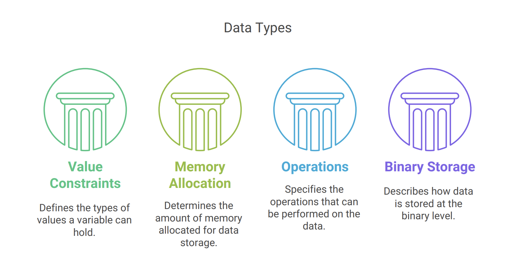
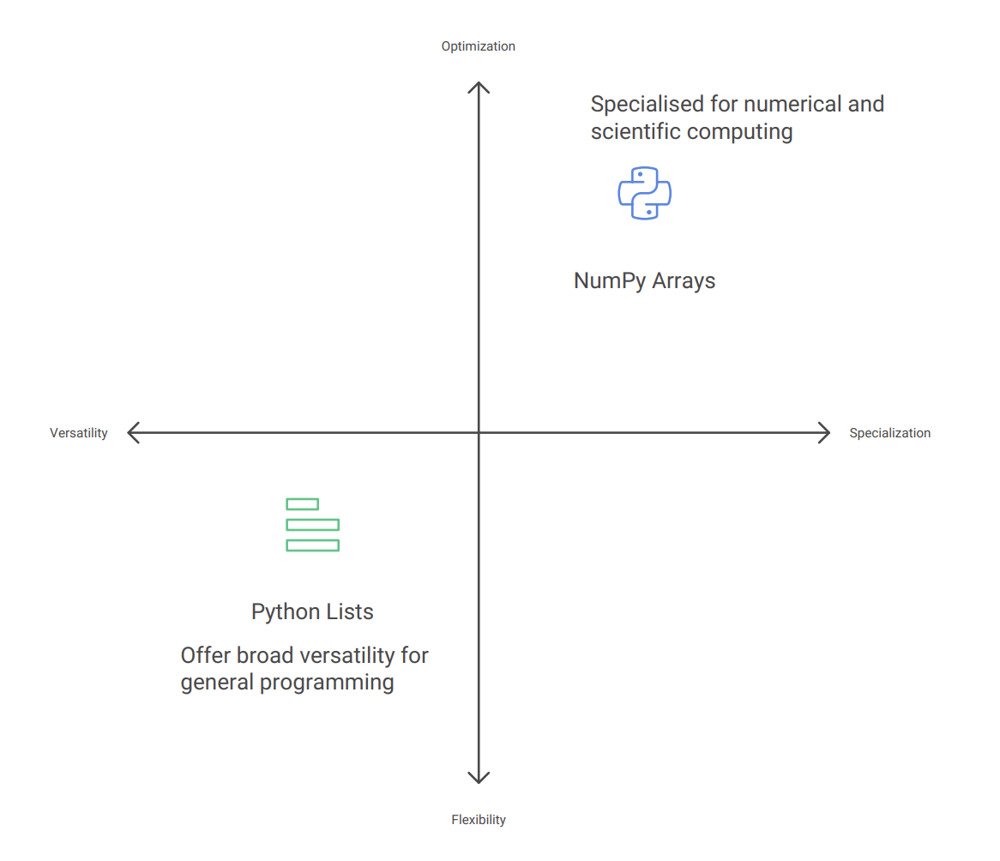

# NumPy Data Types

:::{objectives}

* Explain the fundamental concept of data types and their importance in computing
* Compare and contrast Python's general data types with NumPy's specialized data types
* Identify the key NumPy data types relevant to bioinformatics applications
* Apply data type conversion techniques to optimize NumPy arrays
* Explore different NumPy data types for different bioinformatics use cases

:::

:::{exercise} Time
15 - 20 Minutes
:::

## Introduction to Data Types

Data types are fundamental categories that define how computers interpret and store information in memory



Data types determine:

* What values a variable can hold (e.g., numbers, text, true/false)
* How much memory is allocated
* What operations can be performed
* How the data is stored at the binary level

Understanding data types is crucial because they directly impact:

1. Program correctness: Using inappropriate data types can lead to errors or unexpected behavior
2. Computational performance: Different data types have different processing speeds
   1. e.g., Choosing appropriate data types helps optimize memory usage

In scientific computing and bioinformatics specifically, where we often work with large datasets, choosing the right data type becomes even more critical for both accuracy and performance.

## Python vs NumPy Data Types

Python and NumPy both provide data type systems, but they serve different purposes and have important distinctions:



* Variety and Focus
  * Python data types offer broad versatility for general programming:
    * Integers (`int`): Whole numbers without size limitation
    * Floating-point numbers (`float`): Decimal numbers
    * Strings (`str`): Text data
    * Booleans (`bool`): True/False values
    * Lists, dictionaries, sets, and Complex data structures
  * NumPy data types are specialized for numerical and scientific computing:
    * More precise control over numeric representation (int8, int16, int32, int64, etc.)
    * Greater variety of floating-point precisions (float16, float32, float64)
    * Memory-efficient representations of text and boolean values
    * Specialized types for complex numbers and datetime values

:::{note}
This specialization allows NumPy to provide exactly what's needed for scientific applications without unnecessary overhead. For example, summing a million numbers can be 10-100x faster using NumPy arrays compared to Python lists.
:::

### Memory Management

**Python's approach to memory:**

* Each value comes with extra information (type information, tracking system - reference count)
* Python arranges values wherever it finds room in memory
* It's like having sticky notes scattered across your desk - flexible but takes extra space

**NumPy's approach to memory:**

* Values are stored together in one organized block
* Each value has a fixed, predictable size
* It's like having numbers written in a grid-style notebook - compact and easier to access
* This organization also works better with how your computer naturally processes information

In bioinformatics, where we might analyze gene expression data with millions of values, NumPy's memory efficiency becomes critical.

:::demo

```python
import numpy as np
import time

# Create a larger dataset for more noticeable timing differences
size = 10000000  # 10 million elements

# Create Python list and NumPy array
python_list = [1] * size
numpy_array = np.ones(size, dtype=np.int8)

# Function to multiply each element by 2
def double_python_list(my_list):
    return [x * 2 for x in my_list]

# Timing the Python list operation
start_time = time.time()
doubled_list = double_python_list(python_list)
python_time = time.time() - start_time
print(f"Python list processing time: {python_time:.4f} seconds")

# Timing the NumPy array operation
start_time = time.time()
doubled_array = numpy_array * 2  # Element-wise multiplication
numpy_time = time.time() - start_time
print(f"NumPy array processing time: {numpy_time:.4f} seconds")

# Calculate the speed improvement
speedup = python_time / numpy_time
print(f"NumPy is approximately {speedup:.1f}x faster")
```

:::

### Type Homogeneity

Python collections like lists can contain mixed types:

```python
mixed_list = [1, "DNA", True, 3.14]  # Different types in one list
```

NumPy arrays enforce type homogeneity:

```python
# All elements converted to the same type (float64)
np_array = np.array([1, 2, 3.14, 4])  
```

This homogeneity enables:

* Predictable memory usage
* Optimized vectorized operations
* Simplified data processing logic

For bioinformatics applications, this homogeneity helps ensure consistency when processing large datasets of gene expression values, sequence reads, or alignment scores.

## Key NumPy Data Types

### Integer Types

`np.int64` (64-bit signed integer):

* Range: -9,223,372,036,854,775,808 to 9,223,372,036,854,775,807
* Primary uses in bioinformatics:
  * Storing chromosome positions
  * Indexing into large sequences

Example:

```python
# Storing chromosome positions for a set of genes
gene_positions = np.array([45123, 67845, 123456, 789012], dtype=np.int64)
```

`np.uint8` (8-bit unsigned integer):

* Range: 0 to 255
* Primary uses in bioinformatics:
  * Compact storage for quality scores in FASTQ data
  * Representing nucleotide bases with numeric codes
  * Storing small count data efficiently

Example:

```python
# Representing DNA as numeric codes (A=1, C=2, G=3, T=4)
dna_sequence = np.array([1, 2, 3, 4, 1, 1, 2], dtype=np.uint8)
```

When working with small integers, using `np.uint8` instead of `np.int64` can reduce memory usage by 8x, which becomes significant when processing millions of sequence reads.

### Floating-Point Types

`np.float64` (double-precision float):

* 64 bits of precision (approximately 15-17 significant decimal digits)
* Primary uses in bioinformatics:
  * Storing p-values from statistical tests
  * Representing gene expression values
  * Calculating evolutionary distances
  * Storing probabilities in models

Example:

```python
# Gene expression values from RNA-seq experiment
expression_values = np.array([0.0, 12.5, 45.7, 0.13, 92.1], dtype=np.float64)
```

Bioinformatics often requires high precision for statistical calculations, making `float64` a common choice despite its larger memory footprint.

### Boolean Type

`np.bool_` (Boolean type):

* Values: True or False
* Primary uses in bioinformatics:
  * Creating masks for filtering data
  * Representing presence/absence of features
  * Storing binary outcomes from statistical tests
  * Marking regions of interest in genomic data

Example:

:::{demo}

```python
# Mask for selecting only expressed genes (> 5.0 threshold)
expression_data = np.array([0.1, 7.2, 12.3, 0.0, 6.7])
expressed_mask = expression_data > 5.0  # Creates boolean mask
# Results in: [False, True, True, False, True]

# Use the mask to filter the data
expressed_genes = expression_data[expressed_mask]
# Results in: [7.2, 12.3, 6.7]
```

:::

Boolean arrays in NumPy are extremely useful for data filtering and are more memory-efficient and faster than equivalent Python list comprehensions.

### String Types

`<U#` (Fixed-length string):

* Stores character data with fixed length
* Primary uses in bioinformatics:
  * Storing DNA/RNA sequences
  * Representing gene names, IDs, or annotations
  * Storing taxonomic information

Example:

```python
# Array of gene IDs
gene_ids = np.array(['BRCA1', 'TP53', 'EGFR', 'KRAS'])

# Output
# ['BRCA1' 'TP53' 'EGFR' 'KRAS'] <U5

x = np.array(["1234567890", "12345678901234567890"])
x.dtype

# Output
# dtype('<U20')
```

NumPy's string types are less flexible than Python strings but more memory-efficient when working with large collections of fixed-length identifiers.

## Data Type Conversion and Specification

NumPy provides several ways to specify or convert data types:

### Explicit Type Declaration

```python
# Create array with specific type
counts = np.array([1, 2, 3, 4], dtype=np.int32)

# Convert existing array to new type
float_counts = counts.astype(np.float64)
```

### Checking Data Types

```python
# Check the data type of an array
data = np.array([1.0, 2.0, 3.0])
print(data.dtype)  # Output: float64
```

### Automatic Type Inference

NumPy attempts to choose an appropriate type based on the data:

:::{demo}

```python
np.array([1, 2, 3])            # Creates int64 array
np.array([1.0, 2.0, 3.0])      # Creates float64 array
np.array([True, False, True])  # Creates bool array
np.array(['A', 'C', 'G', 'T']) # Creates string array
```

:::

## Practical Considerations for Bioinformatics

### Memory Optimization

For large genomic datasets, memory usage is critical:

:::{demo}

```python
# Comparison of memory usage for different types
import numpy as np

# Create arrays with different types
int64_array = np.ones(1000000, dtype=np.int64)
int8_array = np.ones(1000000, dtype=np.int8)

# Check memory usage
print(f"int64 array: {int64_array.nbytes / (1024 * 1024):.2f} MB")
print(f"int8 array: {int8_array.nbytes / (1024 * 1024):.2f} MB")
```

:::

The int8 array uses 1/8th the memory of the int64 array, which can make the difference between an analysis running in memory or needing extra resources.

### Performance Considerations

Data types affect computation speed:

:::{demo}

```python
# Summing integers vs floats
int_array = np.arange(10000000, dtype=np.int32)
float_array = np.arange(10000000, dtype=np.float32)

%time int_sum = np.sum(int_array)
%time float_sum = np.sum(float_array)
```

:::

Integer operations are generally faster than floating-point operations, which can be important when processing whole-genome data.

### Type Compatibility in Bioinformatics Pipelines

Different bioinformatics tools may expect specific data types:

* Visualization libraries may require float64 values
* Machine learning models may work best with specific types
* File formats may impose type constraints

Being aware of these requirements helps create more robust analysis pipelines.

## Key Takeaways

:::{Keypoints}

NumPy's specialized data types provide significant advantages for bioinformatics applications:

1. Efficiency - Both in terms of memory usage and computational performance
2. Precision - Control over numeric representation ensures accurate calculations
3. Compatibility - Designed to work well with other scientific computing libraries
4. Consistency - Type homogeneity helps prevent errors in large datasets

By choosing appropriate data types, bioinformaticians can:

* Process larger datasets in memory
* Run analyses faster
* Ensure computational accuracy
* Build more robust analysis pipelines

Understanding the distinctions between Python's general-purpose types and NumPy's specialized numeric types is essential for effective scientific programming in bioinformatics.
:::

## Hands-on

**RNA Expression Analysis - alternative method:**

***Objective:***

* Examine differential expression of immune-related genes between patient groups [previously classified as immunologically strong ('istrong') and immunologically weak ('iweak')](https://pubmed.ncbi.nlm.nih.gov/30393759/)
* Apply an alternative analytical approach using Z-ratio methodology to complement standard differential expression tools like DESeq
* Ranks immune-related genes based on their relative expression differences between the patient groups

***Dataset description:***

* `test_data/Sample_group_info.csv`
  * Patients were divided into `istrong` (immunity-strong) and `iweak` (immunity-weak) groups based on their Immunity score
  * The Immunity score was calculated by averaging the gene expression values of the 17 identified immune-genes
* `test_data/count_matrix.csv`: Gene expression raw counts

***Steps:***

1. Data Loading
   1. Load sample group information (`iweak` vs `istrong`)
   2. Load gene expression count matrix
2. Examine array information

:::{exercise} Hands-on

```python
# What is NumPy and why it's important for bioinformatics
# Performance advantages over Python lists
# Foundation for other scientific libraries

import numpy as np

# Read the CSV file into a numpy array
## CSV file contains sample group information
data = np.genfromtxt("test_data/Sample_group_info.csv", delimiter=',', dtype='str')

# Print the numpy array information

def print_array_info(array):
    # Get the shape of the array
    shape = array.shape

    # Get the number of dimensions of the array
    ndim = array.ndim

    # Get the data type of the array
    dtype = array.dtype

    # Get the number of elements in the array
    size = array.size

    print(f"Shape: {shape} \nNumber of dimensions: {ndim} \nData type: {dtype} \nSize: {size}")


print_array_info(data)

# Read the CSV file into a numpy array with string dtype
## CSV file contains RNA count matrix
count_matrix = np.genfromtxt("test_data/count_matrix.csv", delimiter=',',
                     dtype='str')
print_array_info(count_matrix)

# Remove sample names from the count matrix (cm) - Delete the first row
## Convert the cm to a float32 array
print(count_matrix[0:5, 0:5])
print("___")
cm = np.delete(count_matrix, 0, axis=0).astype("float32")
print(cm[0:5, 0:5])
```

:::
