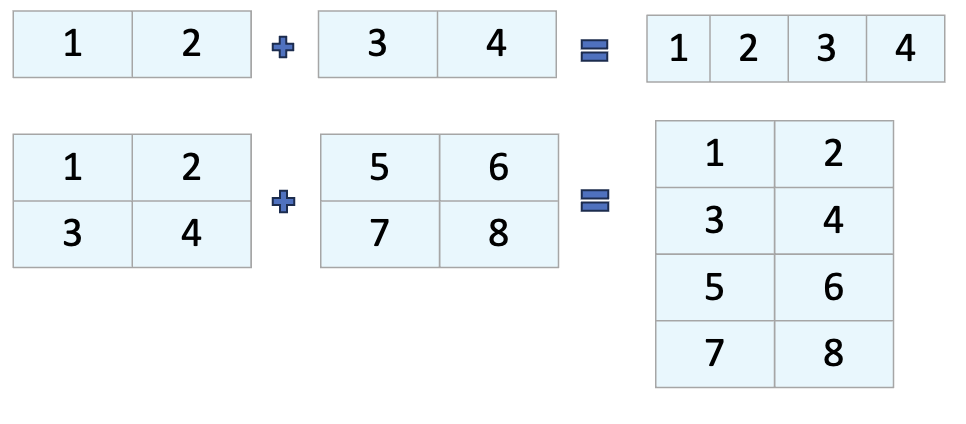

# Essential Array Operations with NumPy

:::{objectives}

1. Reshape arrays to transform data structures while preserving values
2. Combine arrays using concatenation operations along different axes
3. Generate descriptive statistics from arrays using NumPy's built-in functions
4. Apply the axis parameter correctly to perform row-wise and column-wise operations
5. Integrate reshaping, concatenation, and statistical functions to solve practical data problems

:::

:::{exercise} Time
20 Minutes
:::

## Introduction

NumPy is the foundation of Python's data science ecosystem. At its core is the powerful ndarray object - an efficient, versatile container for large datasets. We'll explore three essential capabilities:

* Reshaping arrays to organize data differently
* Combining arrays using concatenation
* Generating summary statistics to understand our data

Let's dive into how these operations can transform the way we work with numerical data.

## Reshaping Arrays

### Understanding Array Dimensions

Arrays can have different dimensions:

* 1D arrays (vectors): Simple sequences of values
* 2D arrays (matrices): Tables with rows and columns
* 3D arrays and beyond: Multi-dimensional structures


The shape and dimension of an array tell us how data is organized:

:::{demo}

```python
import numpy as np

# Create a simple 1D array
a = np.ones(6)
print("Original array:")
print(a)
print(f"Dimensions: {a.ndim}")  # Number of dimensions
print(f"Shape: {a.shape}")      # Tuple showing size in each dimension
```

Output:

```none
Original array:
[1. 1. 1. 1. 1. 1.]
Dimensions: 1
Shape: (6,)
```

:::

### Reshaping Arrays uisng `reshape`


* Reshaping allows us to reorganize the same data into different dimensions
* The key rule: the total number of elements must remain the same

:::{demo}

```python
a = np.array(range(1,7))
# Reshape our 1D array with 6 elements into a 2D array (2 rows, 3 columns)
b = a.reshape(2, 3)
print("\nReshaped to 2x3 array:")
print(b)
print(f"Dimensions: {b.ndim}")
print(f"Shape: {b.shape}")
```

Output

```none
Reshaped to 2x3 array:
[[1 2 3]
 [4 5 6]]
Dimensions: 2
Shape: (2, 3)
```

:::

#### Practical Example: Preparing a Simple Grayscale Image for an ML Model

* Imagine you have a tiny grayscale image, maybe from a very simple dataset. It's represented as a 2D grid of pixel values. Many basic machine learning algorithms (like Logistic Regression or simple Neural Networks) expect input data where each row is a single sample (a single image) and each column is a feature (a single pixel value).

* Our task is to take a 2D image representation and "flatten" it into a 1D row vector suitable for these algorithms.

:::{demo}

```python
import numpy as np

# 2. Imagine a tiny 3x3 pixel grayscale image
#    Each number represents the brightness of a pixel (0=black, 255=white)
#    This is a 2D NumPy array (a matrix)
image_2d = np.array([
    [10, 20, 30],
    [40, 50, 60],
    [70, 80, 90]
])

print("Original 2D Image Array:")
print(image_2d)
print("Shape of original image:", image_2d.shape) # Output: (3, 3) -> 3 rows, 3 columns

# 3. Prepare for ML: Flatten the image
#    Many ML models expect each sample (our image) as a single row.
#    We need to convert the 3x3 grid into a 1x9 row (1 row, 9 features/pixels).
#    Total number of pixels = 3 * 3 = 9

#    Using reshape:
#    We want 1 row, and NumPy can figure out the number of columns needed.
#    We use '-1' to tell NumPy: "calculate the correct number of columns for me".
flattened_image = image_2d.reshape(1, 9)

#    Alternatively, we could be explicit:
#    flattened_image = image_2d.reshape(1, 9)

print("Flattened Image Array (Ready for ML Model):")
print(flattened_image)
print("Shape of flattened image:", flattened_image.shape) # Output: (1, 9) -> 1 row, 9 columns

```

Output

```none
Original 2D Image Array:
[[10 20 30]
 [40 50 60]
 [70 80 90]]
Shape of original image: (3, 3)

Flattened Image Array (Ready for ML Model):
[[10 20 30 40 50 60 70 80 90]]
Shape of flattened image: (1, 9)
```

:::

#### Using -1 as a Dimension

NumPy can automatically calculate one dimension when you use -1:

:::{demo}

```python
image_2d2 = np.array([
     [10, 20, 30],
     [40, 50, 60],
     [70, 80, 90],
     [100, 50, 60],
     [55, 150, 200],
     [150, 100, 220]
 ])

print(f"Flattened image: {image_2d2.reshape(-1, 9)}")
```

Output

```none
array([[ 10,  20,  30,  40,  50,  60,  70,  80,  90],
       [100,  50,  60,  55, 150, 200, 150, 100, 220]])
```

:::

## Array Concatenation

Concatenation lets us combine multiple arrays into a single larger array. This is essential when:

* Merging datasets
* Building up arrays piece by piece
* Combining results from different operations



### 1D Array Concatenation

Let's start with the simplest case - joining two 1D arrays:

:::{demo}

```python
# Create two 1D arrays
a = np.array([1, 2, 3, 4])
b = np.array([5, 6, 7, 8])

# Concatenate them
combined = np.concatenate((a, b))
print("Concatenated 1D arrays:")
print(combined)
```

Output

```none
Concatenated 1D arrays:
[1 2 3 4 5 6 7 8]
```

:::

### 2D Array Concatenation

When working with 2D arrays, we need to specify the axis of concatenation:

axis=0: Join vertically (collapse rows)
axis=1: Join horizontally (collapse columns)

#### Vertical Concatenation (axis=0)

:::{demo}

```python
# Create 2D arrays
x = np.array([[1, 2], [3, 4]])  # 2x2 array
y = np.array([[5, 6]])          # 1x2 array

# Vertical concatenation (default is axis=0)
v_combined = np.concatenate((x, y))
print("\nVertical concatenation (axis=0):")
print(v_combined)
```

Output

```none
Vertical concatenation (axis=0):
[[1 2]
 [3 4]
 [5 6]]
```

:::

#### Horizontal Concatenation (axis=1)

:::{demo}

```python
# Create arrays for horizontal concatenation
p = np.array([[1, 2], [3, 4]])    # 2x2 array
q = np.array([[5], [6]])          # 2x1 array

# Horizontal concatenation (axis=1)
h_combined = np.concatenate((p, q), axis=1)
print("\nHorizontal concatenation (axis=1):")
print(h_combined)
```

Output

```none
Horizontal concatenation (axis=1):
[[1 2 5]
 [3 4 6]]
```

:::

### Concatenation Requirements

For concatenation to work properly:

* Arrays must have the same shape except in the dimension you're concatenating
* The non-concatenation dimensions must match exactly

:::{demo}

```python
a = np.array([[1, 2, 3]])   # Shape: (1, 3)
b = np.array([[4, 5, 6, 7]]) # Shape: (1, 4)

np.concatenate((a,b), axis=0)
```

Output

```none
ValueError: all the input array dimensions except for the concatenation axis must match exactly, but along dimension 1, the array at index 0 has size 3 and the array at index 1 has size 4
```

```python
a = np.array([[1, 2, 3]])   # Shape: (1, 3)
b = np.array([[4, 5, 6, 7]]) # Shape: (1, 4)
np.concatenate((a,b), axis=1)
```

Output

```python
array([[1, 2, 3, 4, 5, 6, 7]])
```

:::

## Summary Statistics

NumPy provides efficient functions to calculate statistical measures across arrays. These are essential for:

* Data exploration and understanding
* Identifying patterns and outliers
* Summarizing large datasets

| Function | Description     |
|----------|-----------------|
| np.sum() | Sum of array elements  |
| np.min() | Minimum value    |
| np.max() | Maximum value    |
| np.mean() | Arithmetic mean (average) |
| np.median() | Median value    |
| np.std() | Standard deviation   |
| np.var() | Variance     |

axis=None (default): Operate on all elements (flattened array)
axis=0: Collapse rows and operate along columns (down)
axis=1: Collapse columns and operate along rows (across)

:::{demo}

```python
# Create a 2D array
data = np.array([[1, 2, 3],
                 [4, 5, 6]])

print("Our data:")
print(data)

# Sum of all elements
total = np.sum(data)
print(f"\nTotal sum: {total}")  # 21

# Column sums (axis=0)
col_sums = np.sum(data, axis=0)
print(f"Column sums: {col_sums}")  # [5 7 9]

# Row sums (axis=1)
row_sums = np.sum(data, axis=1)
print(f"Row sums: {row_sums}")  # [6 15]
```

:::
