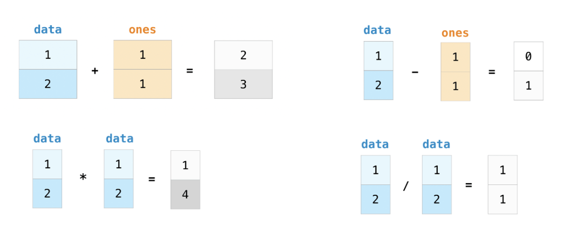

# Vectorized Operations in NumPy: Beyond Python Loops

:::{objectives}
By the end of this lecture, you will be able to:

* Understand and implement vectorized operations to replace traditional Python loops
* Apply broadcasting to perform operations between arrays of different shapes
* Optimize calculations for working with large biological datasets
:::

:::{exercise} Time
20 Minutes
:::

## Introduction to Vectorized Operations

### What are Vectorized Operations?

Vectorized operations allow us to perform mathematical operations on entire arrays at once, rather than iterating through each element individually. This approach offers several key advantages:

* Performance:
  * Vectorized operations are significantly faster than Python loops, especially for large datasets
* Readability:
  * The code becomes more concise and often easier to understand
* Efficiency:
  * NumPy uses optimized C code under the hood, making calculations much more efficient

### The Speed Advantage: Loops vs. Vectorization

Let's see a simple example comparing a traditional Python loop with NumPy's vectorized approach:

:::{demo}

```python
import numpy as np
import time

# Create a large array for testing
size = 10000000
data = np.random.random(size)

# Method 1: Traditional Python loop
start_time = time.time()
result_loop = []
for value in data:
    result_loop.append(value * 2 + 5)
loop_time = time.time() - start_time
print(f"Python loop time: {loop_time:.4f} seconds")

# Method 2: NumPy vectorized operation
start_time = time.time()
result_vectorized = data * 2 + 5
vector_time = time.time() - start_time
print(f"NumPy vectorized time: {vector_time:.4f} seconds")

# Calculate the speedup
speedup = loop_time / vector_time
print(f"Vectorized operations are {speedup:.1f}x faster!")
```

Output

```none
Python loop time: 1.0195 seconds
NumPy vectorized time: 0.0613 seconds
Vectorized operations are 16.6x faster!
```

:::

## Basic Vectorized Operations in NumPy

### Arithmetic Operations

NumPy enables element-wise arithmetic operations on arrays:



:::{demo}

```python
import numpy as np

# Create two arrays
a = np.array([1, 2, 3, 4, 5])
b = np.array([10, 20, 30, 40, 50])

# Element-wise operations
addition = a + b
subtraction = b - a
multiplication = a * b
division = b / a

print(f"Addition: {addition}")
print(f"Subtraction: {subtraction}")
print(f"Multiplication: {multiplication}")
print(f"Division: {division}")
```

Output

```none
Addition: [11 22 33 44 55]
Subtraction: [ 9 18 27 36 45]
Multiplication: [ 10  40  90 160 250]
Division: [10. 10. 10. 10. 10.]
```

:::

### Scalar Operations

You can perform operations between arrays and scalars (single values):


:::{demo}

```python
# Scalar operations
a = np.array([1, 2, 3, 4, 5])

plus_10 = a + 10
times_2 = a * 2
square = a ** 2
reciprocal = 1 / a

print(f"Plus 10: {plus_10}")
print(f"Times 2: {times_2}")
print(f"Squared: {square}")
print(f"Reciprocal: {reciprocal}")
```

Output

```none
Plus 10: [11 12 13 14 15]
Times 2: [ 2  4  6  8 10]
Squared: [ 1  4  9 16 25]
Reciprocal: [1.         0.5        0.33333333 0.25       0.2       ]
```

:::

### Comparison Operations

Comparison operations create boolean masks that can be useful for filtering data:

:::{demo}

```python
# Comparison operations
a = np.array([1, 2, 3, 4, 5])

greater_than_3 = a > 3
less_than_equal_to_2 = a <= 2
equal_to_3 = a == 3

print(f"a > 3: {greater_than_3}")
print(f"a <= 2: {less_than_equal_to_2}")
print(f"a == 3: {equal_to_3}")

# Using boolean masks for filtering
filtered_data = a[greater_than_3]   # [4, 5]
print(f"Values greater than 3: {filtered_data}")
```

Output

```none
a > 3: [False False False  True  True]
a <= 2: [ True  True False False False]
a == 3: [False False  True False False]
Values greater than 3: [4 5]
```

:::

### Universal Functions (ufuncs)

NumPy provides a wide range of universal functions (ufuncs) that operate element-wise on arrays:

:::{demo}

```python
# Universal functions (ufuncs)
a = np.array([1, 2, 3, 4, 5])

sqrt_values = np.sqrt(a)            # Square root of each element
log_values = np.log(a)              # Natural logarithm of each element
exp_values = np.exp(a)              # e raised to the power of each element
sin_values = np.sin(a)              # Sine of each element

print(f"Square roots: {sqrt_values}")
print(f"Natural logs: {log_values}")
print(f"Exponentials: {exp_values}")
print(f"Sine values: {sin_values}")
```

Output

```none
Square roots: [1.         1.41421356 1.73205081 2.         2.23606798]
Natural logs: [0.         0.69314718 1.09861229 1.38629436 1.60943791]
Exponentials: [  2.71828183   7.3890561   20.08553692  54.59815003 148.4131591 ]
Sine values: [ 0.84147098  0.90929743  0.14112001 -0.7568025  -0.95892427]
```

:::

### Aggregation Functions

NumPy also provides functions to calculate aggregate statistics across arrays:


:::{demo}

```python
# Aggregation functions
a = np.array([1, 2, 3, 4, 5])

sum_a = np.sum(a)                   # Sum of all elements (15)
mean_a = np.mean(a)                 # Mean of all elements (3.0)
min_a = np.min(a)                   # Minimum value (1)
max_a = np.max(a)                   # Maximum value (5)
std_a = np.std(a)                   # Standard deviation (~1.41)

print(f"Sum: {sum_a}")
print(f"Mean: {mean_a}")
print(f"Min: {min_a}")
print(f"Max: {max_a}")
print(f"Standard deviation: {std_a}")
```

Output

```none
Sum: 15
Mean: 3.0
Min: 1
Max: 5
Standard deviation: 1.4142
```

:::

**Use NumPy's Built-in Functions**: They're optimized for performance

:::{exercise}

```python
import numpy as np
import time

# Create a large array
size = 1_000_000
data = np.random.random(size)

# Method 1: Custom function with a loop
def mean_std_loop(arr):
    mean = sum(arr) / len(arr)
    squared_diff_sum = sum((x - mean) ** 2 for x in arr)
    std = (squared_diff_sum / len(arr)) ** 0.5
    return mean, std

# Method 2: NumPy's built-in functions
def mean_std_numpy(arr):
    return np.mean(arr), np.std(arr)

# Time the loop version
start = time.time()
mean1, std1 = mean_std_loop(data)
time1 = time.time() - start

# Time the NumPy version
start = time.time()
mean2, std2 = mean_std_numpy(data)
time2 = time.time() - start

print(f"Loop implementation: {time1:.6f} seconds")
print(f"NumPy implementation: {time2:.6f} seconds")
print(f"Speed improvement: {time1/time2:.1f}x")
```

:::

## 3. Broadcasting in NumPy

### What is Broadcasting?

Broadcasting is a powerful mechanism that allows NumPy to perform operations on arrays of different shapes. It automatically "broadcasts" the smaller array across the larger array so that they have compatible shapes.


### Broadcasting Rules

1. If the arrays don't have the same number of dimensions, the shape of the smaller array is padded with ones on the left
2. If the shape of the arrays doesn't match in any dimension, the array with shape equal to 1 in that dimension is stretched to match the other shape
3. If in any dimension the sizes disagree and neither is equal to 1, an error is raised

### Broadcasting Examples

#### Example 1: Adding a scalar to an array

The simplest form of broadcasting:

:::{demo}

```python
# Adding a scalar to an array
a = np.array([1, 2, 3, 4, 5])
result = a + 10  # Scalar 10 is broadcast to array [10, 10, 10, 10, 10]
print(result)    # [11, 12, 13, 14, 15]
```

:::

:::{discussion}
If the sizes along a dimension differ, the array with size 1 in that dimension is stretched to match the other size
:::

#### Example 2: Operations between a 1D array and a 2D array

:::{demo}

```python
# Broadcasting with different dimensional arrays
# Create a 2D array (3x3)
matrix = np.array([
    [1, 2, 3],
    [4, 5, 6],
    [7, 8, 9]
])

# Create a 1D array
row_vector = np.array([10, 20, 30])

# Broadcasting: Add the 1D array to each row of the 2D array
# row_vector is broadcast to match matrix's shape
result = matrix + row_vector

print("Original matrix:")
print(matrix)
print("\nRow vector:")
print(row_vector)
print("\nResult after broadcasting addition:")
print(result)
# Output:
# [[11, 22, 33],
#  [14, 25, 36],
#  [17, 28, 39]]
```

:::

:::{discussion}

Broadcasting the 1D Array: NumPy "stretches" the row_vector along the first dimension to match the shape of the matrix. This means that row_vector is duplicated across the rows of the matrix, effectively resembling:
:::

#### Example 3: Adding a column vector to a 2D array

:::{demo}

```python
# Create a column vector (3x1)
column_vector = np.array([[100], [200], [300]])

# Broadcasting: Add the column vector to each column of the matrix
result = matrix + column_vector

print("Original matrix:")
print(matrix)
print("\nColumn vector:")
print(column_vector)
print("\nResult after broadcasting addition:")
print(result)
# Output:
# [[101, 102, 103],
#  [204, 205, 206],
#  [307, 308, 309]]
```

:::

:::{discussion}
`column_vector` is effectively repeated across all columns, resulting in:

```none
[[100, 100, 100],
 [200, 200, 200],
 [300, 300, 300]]
```

:::

## Array Splitting with NumPy

Splitting arrays is a common operation when working with biological data, especially when you need to separate data into training and testing sets or divide data by conditions.

### Basic Array Splitting

The `np.split` function allows you to divide an array into multiple sub-arrays:

:::{demo}

```python
import numpy as np

# Create a simple array
arr = np.arange(10)
print(f"Original array: {arr}")

# Split into 5 equal parts
splits = np.split(arr, 5)
print("After splitting into 5 equal parts:")
for i, split in enumerate(splits):
    print(f"Split {i}: {split}")
```

Output

```none
Original array: [0 1 2 3 4 5 6 7 8 9]
After splitting into 5 equal parts:
Split 0: [0 1]
Split 1: [2 3]
Split 2: [4 5]
Split 3: [6 7]
Split 4: [8 9]
```

:::

### Splitting 2D Arrays

You can split arrays along different axes:

:::{demo}

```python
# Create a 4x4 array
arr_2d = np.arange(16).reshape(4, 4)
print("Original 2D array:")
print(arr_2d)

# Split along rows (axis=0)
row_splits = np.split(arr_2d, 2, axis=0)
print("\nSplit along rows (axis=0):")
for i, split in enumerate(row_splits):
    print(f"Split {i}:")
    print(split)

# Split along columns (axis=1)
col_splits = np.split(arr_2d, 2, axis=1)
print("\nSplit along columns (axis=1):")
for i, split in enumerate(col_splits):
    print(f"Split {i}:")
    print(split)
```

Output

```none
Original 2D array:
[[ 0  1  2  3]
 [ 4  5  6  7]
 [ 8  9 10 11]
 [12 13 14 15]]

Split along rows (axis=0):
Split 0:
[[0 1 2 3]
 [4 5 6 7]]
Split 1:
[[ 8  9 10 11]
 [12 13 14 15]]

Split along columns (axis=1):
Split 0:
[[ 0  1]
 [ 4  5]
 [ 8  9]
 [12 13]]
Split 1:
[[ 2  3]
 [ 6  7]
 [10 11]
 [14 15]]
```

:::

### Splitting at Specific Indices

You can also split an array at specific indices:

:::{demo}

```python
# Create an array
arr = np.arange(10)
print(f"Original array: {arr}")

# Split at indices 2 and 7
splits = np.split(arr, [2, 7])
print("\nAfter splitting at indices [2, 7]:")
for i, split in enumerate(splits):
    print(f"Split {i}: {split}")
```

Output

```none
Original array: [0 1 2 3 4 5 6 7 8 9]

After splitting at indices [2, 7]:
Split 0: [0 1]
Split 1: [2 3 4 5 6]
Split 2: [7 8 9]
```

:::

Application: Train-Test Split in machine learning

## Avoiding Common Mistakes

**Copying vs. Viewing**: Be aware of when you're creating a view versus a copy

:::{demo}

```python
# Creating a view - changes to 'view' will affect 'original'
original = np.array([1, 2, 3, 4, 5])
view = original[1:4]
view[0] = 99
print(f"Original after modifying view: {original}")  # [1, 99, 3, 4, 5]

# Creating a copy - changes to 'copy' won't affect 'original'
original = np.array([1, 2, 3, 4, 5])
copy = original[1:4].copy()
copy[0] = 99
print(f"Original after modifying copy: {original}")  # [1, 2, 3, 4, 5]
```

:::

**Broadcasting Dimensions**: Be careful with dimensions when broadcasting

:::{demo}

```python
# This works as expected
a = np.array([[1, 2, 3], [4, 5, 6]])  # 2x3
b = np.array([10, 20, 30])            # 1D with 3 elements
result = a + b
print(result)

# This will fail because dimensions don't align properly
try:
    c = np.array([10, 20])            # 1D with 2 elements
    result = a + c
except ValueError as e:
    print(f"Error: {e}")
```

:::

## Best Practices

1. **Avoid Python Loops** when working with numerical data; use vectorized operations instead
2. **Use Broadcasting** wisely to make your code concise and efficient
3. **Pre-allocate Arrays** when you know their size in advance
4. **Leverage NumPy's Built-in Functions** for optimal performance
5. **Be Mindful of Memory Usage** when working with large biological datasets

Vectorized operations in NumPy are a powerful tool for data analysis in computational biology. By replacing traditional loops with vectorized operations, you can significantly improve the performance and readability of your code, making it easier to work with large biological datasets.

## Exercises

:::{exercise}

1. **Basic Vectorization**: Convert the following loop to a vectorized operation:

   ```python
   # Loop version
   result = []
   for i in range(1, 101):
       if i % 2 == 0:
           result.append(i ** 2)
       else:
           result.append(i ** 3)
   ```

2. **Broadcasting Practice**: Create a function to normalize each row of a 2D array to have zero mean and unit variance.

3. **Biological Application**: Given gene expression data for multiple samples, identify genes with expression levels above the 95th percentile in each sample.

4. **Advanced Vectorization**: Implement a vectorized version of the Euclidean distance calculation between all pairs of samples in a gene expression dataset.

5. **Array Splitting**: Split a dataset of patient records into training, validation, and test sets with 70%, 15%, and 15% of the data, respectively.
:::

### Key Takeaways

:::{Keypoints}

1. **Vectorized Operations** are much faster than Python loops for numerical computations
2. **Broadcasting** allows operations between arrays of different shapes
3. **NumPy's Universal Functions** provide efficient implementations of common mathematical operations
4. **Array Splitting** is useful for dividing data for analysis and machine learning

:::

## Hands-on

***Objective:***

* Examine differential expression of immune-related genes between patient groups [previously classified as immunologically strong ('istrong') and immunologically weak ('iweak')](https://pubmed.ncbi.nlm.nih.gov/30393759/)
* Apply an alternative analytical approach using Z-ratio methodology to complement standard differential expression tools like DESeq
* Ranks immune-related genes based on their relative expression differences between the patient groups

***Dataset description:***

* `test_data/Sample_group_info.csv`
  * Patients were divided into `istrong` (immunity-strong) and `iweak` (immunity-weak) groups based on their Immunity score
  * The Immunity score was calculated by averaging the gene expression values of the 17 identified immune-genes
* `test_data/count_matrix.csv`: Gene expression raw counts

***Workflow:***

```{mermaid}
flowchart TD
    A[Load Sample Group Info] --> B{Filter by Group}
    B -->|iweak| C[Identify iweak samples]
    B -->|istrong| D[Identify istrong samples]
    
    E[Load Count Matrix] --> F[Match columns with samples]
    
    F --> G[Convert to numeric]
    G --> H[Log2 transformation]
    
    C --> F
    D --> F
    
    H --> I1[Calculate iweak mean & std]
    H --> I2[Calculate istrong mean & std]
    
    I1 --> J1[Compute Z-scores for iweak]
    I2 --> J2[Compute Z-scores for istrong]
    
    J1 --> K[Calculate Z-score difference]
    J2 --> K
    
    K --> L[Calculate standard deviation]
    
    L --> M[Compute Z-ratio]
    
    M --> N[Rank genes by Z-ratio]
    
    classDef dataNode fill:#f9f9f9,stroke:#aaa,stroke-width:2px;
    classDef processNode fill:#e1f5fe,stroke:#01579b,stroke-width:2px;
    classDef resultNode fill:#e8f5e9,stroke:#2e7d32,stroke-width:2px;
    
    class A,E dataNode;
    class B,C,D,F,G,H,I1,I2,J1,J2,K,L,M processNode;
    class N resultNode;
```

***Steps:***

1. Data Loading and visualization
   1. Load sample group information (`iweak` vs `istrong`)
   2. Load gene expression count matrix
   3. Examine array information
2. Sample Identification
   1. Filter samples by group (`iweak`/`istrong`)
   2. Match count matrix columns with sample IDs
3. Data Preprocessing
   1. Convert count matrix to numeric values
   2. Apply log2 transformation: log2(counts + 1)
4. Statistical Analysis
   1. Calculate mean and std for each gene within each group
   2. Compute Z-scores within each sample group
   3. Calculate Z-score differences between groups
   4. Compute standard deviation of all differences
5. Ranking Genes
   1. Calculate Z-ratio: difference / std_difference
   2. Rank genes by Z-ratio (highest to lowest)

:::{exercise} Hands-on

```python

import numpy as np

# Read the CSV file into a numpy array
data = np.genfromtxt("test_data/Sample_group_info.csv", delimiter=',', dtype='str')

def print_array_info(array):
    # Get the shape of the array
    shape = array.shape
    # Get the number of dimensions of the array
    ndim = array.ndim
    # Get the data type of the array
    dtype = array.dtype
    # Get the number of elements in the array
    size = array.size
    print(f"Shape: {shape} \nNumber of dimensions: {ndim} \nData type: {dtype} \nSize: {size}")

# Access indices of the array where the second column is 'iweak'
iweak_index = np.where(data[:, 1] == 'iweak')
print(iweak_index)
print_array_info(iweak_index[0])

# Access indices of the array where the second column is 'iweak'
## Assign the indices to a iweak_index (not the tuple returned by np.where)
iweak_index = np.where(data[:, 1] == 'iweak')[0]
print_array_info(iweak_index)

# Access indices of the array where the second column is 'istrong'
## Assign the indices to a istrong_index (not the tuple returned by np.where)
istrong_index = np.where(data[:, 1] == 'istrong')[0]
print(istrong_index)
print_array_info(istrong_index)

# Load count matrix
count_matrix = np.genfromtxt("test_data/count_matrix.csv", delimiter=',', dtype='str')

# View the first column of the count matrix where the sample group is 'iweak'
print(count_matrix[0:5, 0:5])
print("___")

# Create a boolean mask to find if the columns in the count matrix where the sample group is 'iweak'
cm_iweak_mask = np.isin(count_matrix[0, :], data[iweak_index, 0])
print(cm_iweak_mask[:30])

# Find the indices of the columns in the count matrix where the sample group is 'iweak'
cm_weak_cols = np.where(cm_iweak_mask)[0]
print(cm_weak_cols)
print_array_info(cm_weak_cols)

# Find the indices of the columns in the count matrix where the sample group is 'istrong'
cm_strong_cols = np.where(np.isin(count_matrix[0, :], data[istrong_index, 0]))[0]
print(cm_strong_cols)
print_array_info(cm_strong_cols)

# Remove sample names from the count matrix (cm) - Delete the first row
## Convert the cm to a float32 array
print(count_matrix[0:5, 0:5])
print("___")
cm = np.delete(count_matrix, 0, axis=0).astype("float32")
print(cm[0:5, 0:5])

# """
### Convert cm to log scale
# Gene expression count data often contains zeros (genes that weren't detected)
# Since log₂(0) is mathematically undefined (negative infinity), we add 1 to every value
# This is called a "pseudo-count" approach, creating what's known as "log₂(counts+1)"

### Differences in log space correspond to fold changes in original space
# A difference of 1 in log₂ space = a 2-fold change in original counts
# A difference of 2 in log₂ space = a 4-fold change in original counts
# """

cm = np.log2(cm + 1)
print(cm)
print_array_info(cm)

# Calculate mean and STD of each gene in iweak samples
iweak_mean = cm[:, cm_weak_cols].mean(1)    ## Mean of iweak samples
iweak_std = cm[:, cm_weak_cols].std(1)      ## STD of iweak samples

print(cm.shape)
print("--------")
print(iweak_mean[:5], iweak_mean.shape)

# Calculate mean and STD of each gene in istrong samples
istrong_mean = cm[:,cm_strong_cols].mean(1) ## Mean of istrong disease samples
istrong_std = cm[:,cm_strong_cols].std(1)   ## STD of istrong samples

```

**Z-scores:**

* Gene expression measurements (counts) can have vastly different scales across different samples due to technical variations
* The Z-score transformation standardizes these measurements

```{math}
    Z_{G} = \frac{(Count_G - \mu_{Count_{group}})}{\sigma_{Count_{group}}}
```

$$ Z_{G} : Z-score\ for\ a\ gene\ G$$
$$ Count_G: Log10\ count\ of\ gene\ G\ in\ a\ given\ sample$$
$$ \mu_{Count_{group}}: The\ overall\ average\ across\ all\ samples\ in\ the\ given\ group\ for\ each\ gene$$
$$ \sigma_{Count_{group}}: Standard\ deviation\ all\ samples\ in\ the\ given\ group\ for\ each\ gene$$

**Z-ratio = Z-score difference (per gene):**

* The Z-ratio provides a standardized measure of the difference between conditions for each gene
* This accounts for the overall variability in the experiment
* A gene showing a difference of, say, 0.5 in average Z-score
  * might be highly significant if most genes show very little difference (small Z-score difference - SD),
  * but not significant if many genes show large differences (large Z-score difference - SD)
* It puts the individual gene's change in the context of the overall experimental variation

```{math}
Z.score_{Diff_{gene}} = \bar{Z}_{Gene, istring} - \bar{Z}_{Gene, iweak} \\

Z_{Ratio, Gene} = \frac{Z.score_{Diff_{gene}}}{SD_{Z.score_{Diff_{gene}}}}
```

```python
# Calculate Z-scores of each gene in iweak samples (vectorized)
cm_iweak_z = (cm[:, cm_weak_cols] - iweak_mean.reshape(-1, 1)) / iweak_std.reshape(-1, 1)
print_array_info(cm_iweak_z)

# Calculate stats for each gene in istrong samples
istrong_mean = cm[:,cm_strong_cols].mean(1)
istrong_std = cm[:,cm_strong_cols].std(1)

# Calculate Z-scores of each gene in istrong samples (vectorized)
cm_istrong_z = (cm[:, cm_strong_cols] - istrong_mean.reshape(-1, 1)) / istrong_std.reshape(-1, 1)
print_array_info(cm_istrong_z)

### """ 
# Calculate Z-Ratio differences between two groups
# Calculate
#   difference between the averages of the observed gene Z scores of the two groups
#   SD of Z-Ratio difference
### """

diff_z_scores = cm_istrong_z.mean(1) - cm_iweak_z.mean(1)
std_diff = diff_z_scores.std()

### z-score ratio for each gene
## Divide Z-Ratio differences by the Z-Ratio differences SD
z_score_ratios = diff_z_scores / std_diff
print_array_info(z_score_ratios)
print(z_score_ratios[:10])
```

:::

:::{solution} Visual representation

```{math}
Z_{G} = \frac{(Count_G - \mu_{Count_{group}})}{\sigma_{Count_{group}}}
```

**Visual representation - converting count matrix to z-score matrix:**


```{math}

Z.score_{Diff_{gene}} = \bar{Z}_{Gene, istring} - \bar{Z}_{Gene, iweak} \\

Z_{Ratio, Gene} = \frac{Z.score_{Diff_{gene}}}{SD_{Z.score_{Diff_{gene}}}}
```

**Visual representation - Calculate z-ratio:**


:::

:::{exercise} Hands-on

**Rank genes according to the Z score ratio:**

* Sort `z_score_ratio` in descending order and access indices
* Rank genes using indices

```python

gene_list = ["ACTR3B", "ANLN", "APOBEC3G", "AURKA", "BAG1", "BCL2", "BIRC5", "BLVRA", "CCL5", "CCNB1", "CCNE1", "CCR2", "CD2", "CD27", "CD3D", "CD52", "CD68", "CDC20", "CDC6", "CDH3", "CENPF", "CEP55", "CORO1A", "CTSL2", "CXCL9", "CXXC5", "EGFR", "ERBB2", "ESR1", "EXO1", "FGFR4", "FOXA1", "FOXC1", "GAPDH", "GPR160", "GRB7", "GSTM1", "GUSB", "GZMA", "GZMK", "HLA-DMA", "IL2RG", "KIF2C", "KRT14", "KRT17", "KRT5", "LCK", "MAPT", "MDM2", "MELK", "MIA", "MKI67", "MLPH", "MMP11", "MRPL19", "MYBL2", "MYC", "NAT1", "NDC80", "NUF2", "ORC6", "PGR", "PHGDH", "PRKCB", "PSMC4", "PTPRC", "PTTG1", "RRM2", "SCUBE2", "SF3A1", "SFRP1", "SH2D1A", "SLC39A6", "TFRC", "TMEM45B", "TP53", "TYMS", "UBE2C", "UBE2T", "VEGFA"]

### `np.argsort()` returns indices of the array that would sort in ascending order
### slicing syntax [start:stop:step] with step -1 returns a reversed array

gene_ranks = np.argsort(z_score_ratios)[::-1]
print("Genes ranked according to Z-score ratio:")
print(np.array(gene_list)[gene_ranks])
```

:::
